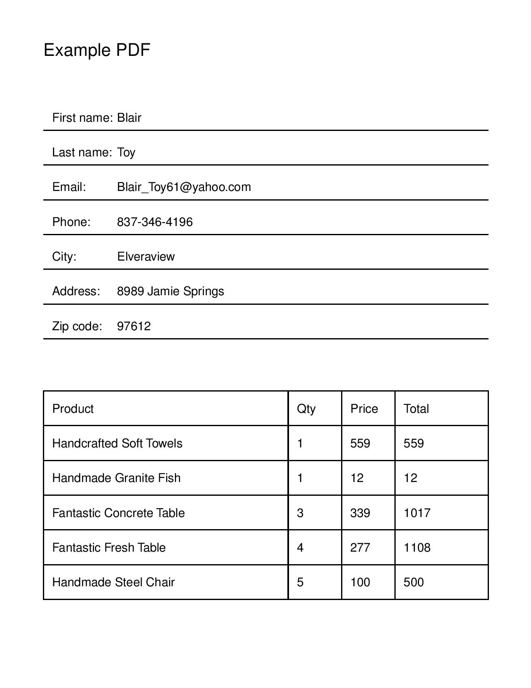
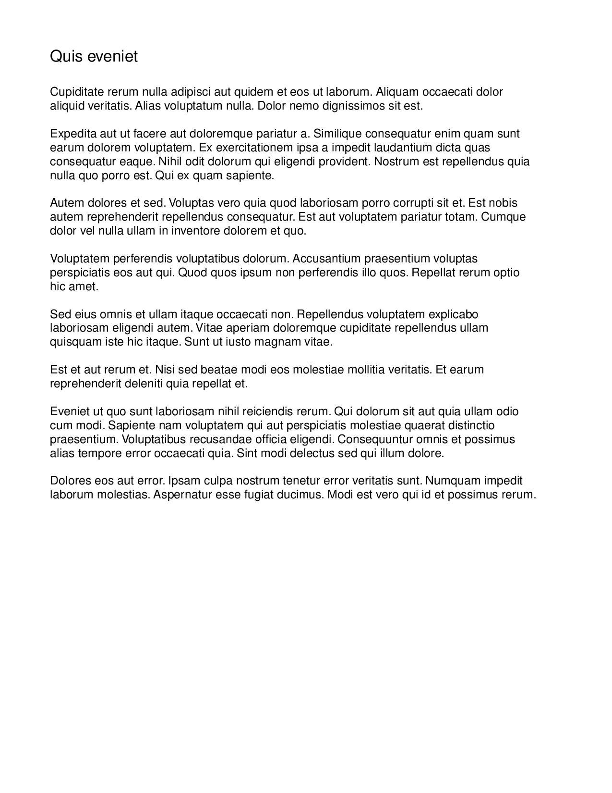

# PDFKit testing

`npm run init` to create the documents folder where PDFs will be saved and to create the build folder.

`npm run dev` to run in development mode. You can preview the document in browser by opening index.html. Uses watchify to automatically build when changes are saved.

`npm start <amount>` to generate PDF files. Default value for amount is 1 and it is limited to 1000. You can change these from index.js

`npm run clean` to delete the PDF files.

### Here is an example PDF

